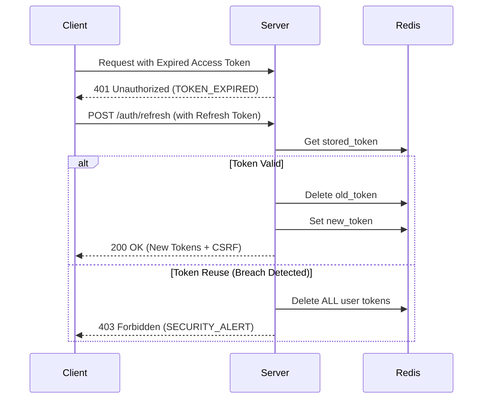

# 🛡️ Admin Security Architecture

This document outlines the security protocols and architectural flows protecting the Gamet Admin Panel.

## 1. Authentication Layer

### Multi-Factor Authentication (MFA)
- **Engine**: `speakeasy` (TOTP).
- **Flow**: User scans a QR code containing a Base32 secret. The server verifies 6-digit tokens with a 2-step (1 minute) "Time Drift" tolerance to account for device clock discrepancies.
- **Enforcement**: Required for sensitive administrative actions if enabled.

### Google SSO & Account Linking
- **Provider**: Passport.js (Google OAuth 2.0).
- **Security**: Upon successful OAuth handshake, the system verifies the user's `googleId`. If MFA is active, the pulse is held until a secondary TOTP code is provided.

---

## 2. Session Management (Identity Pulse)

### Multi-Device Awareness
Every connection is a unique "Pulse".
- **Metadata**: We capture `req.ip` (or `x-forwarded-for`) and `user-agent`.
- **Storage**: Sessions are stored in MongoDB (`sessions` collection) and synchronized with Redis for performance.

### Token Rotation Flow
We use a **Strict Rotation Protocol**:
1. Frontend sends `accessToken` (short-lived).
2. On expiry, `refreshToken` is sent to `/auth/refresh`.
3. Server verifies token against Redis.
4. **Rotation**: A *new* `accessToken` AND a *new* `refreshToken` are issued.
5. Old tokens are instantly invalidated.

---

## 3. Step-Up Re-authentication

Critical actions (User Deletion, System Settings) require a "Identity Handshake" if the user hasn't verified their password/MFA in the last 5 minutes.

- **Redis Key**: `reauth:{userId}:{sessionId}` (TTL: 300s).
- **Methods**: 
    - **Password**: Standard credential check.
    - **MFA**: TOTP token verification.
    - **Google**: Fresh OAuth challenge with identity matching.

---

## 4. Data Integrity & Defenses

### CSRF Protection
- **Mechanism**: Double-Submit Cookie Pattern.
- **Header**: `x-csrf-token`.
- **Validation**: Enforced on all `POST`, `PUT`, `DELETE` requests in the `csrfMiddleware`.

### Access Revocation (Bail-on-Ban)
If an administrator initiates a "Ban" or "Revoke Session" command:
1. The target session is deleted from MongoDB.
2. The refresh token is purged from Redis.
3. The next request from the target device will fail `isAuthenticated` middleware and force an immediate logout.

### Admin Timeout
- **Duration**: 30 Minutes.
- **Mechanism**: The `isAuthenticated` middleware checks `lastActivity` on the session. If > 30m, the session is purged.

---

## 5. Security Center (Admin UI)
The **Security Center** (`SecurityManagement.jsx`) allows real-time auditing of these systems:
- **Shield Protection**: UI for enabling/disabling MFA.
- **Identity Pulse**: Visual map of all active connections with "Revoke" capabilities.
- **Pulse Indicators**: Visual cues to identify the current device vs remote connections.
